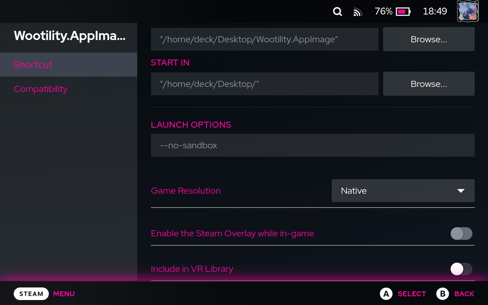
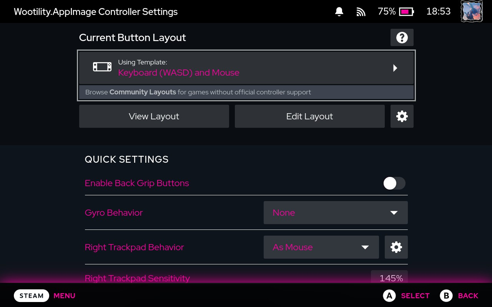
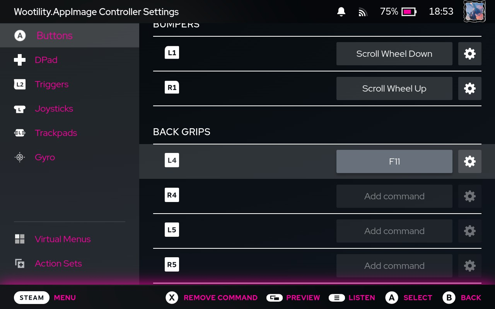

<h1 align="center">
    WootInstaller
 

</h1>

# wootinstaller
Wootility auto-configurator and installer for Linux/Steam Deck

# installation
Click on the image above or [download this link](https://raw.githubusercontent.com/Calslock/wootinstaller/master/InstallWootility.desktop) (right-click and Save Link As...) and run it.

This will automatically set necessary udev rules for Wootility and install Wootility on your Desktop.

When installing on Deck, remember that you have to set up password for your user with `passwd` command in terminal.

# running in game mode on deck
Running Wootility in Game Mode is possible, but it needs some configuration beforehand.

When in Desktop Mode, on Steam select `Add a Game`, then `Add a Non-Steam Game` and choose Wootility from your Desktop. Afterwards, return back to Game Mode.

In Game mode choose Wootility.AppImage and go to Properties (cog icon). Add `--no-sandbox` to Launch options, and choose `Native` in Game Resolution.

Now the app should launch correctly, however you won't be able to use it without changing controller settings. Now go to Controller Settings (controller icon) and change layout to `Keyboard (WASD) and Mouse` template.

After this step you'll be able to use right trackpad and L2/R2 to navigate through the app. However you might notice that you can't access the whole window with mouse cursor. This is a bug with Deck's Game Mode, but is easily fixable by running the app in fullscreen.

In Controller Settings menu choose `Edit Layout`, pick one of the unused buttons (I chose L4) and bind `F11` to it. Now, after launching Wootility, press this button to go into fullscreen - you'll have to press this button everytime after launching Wootility.

